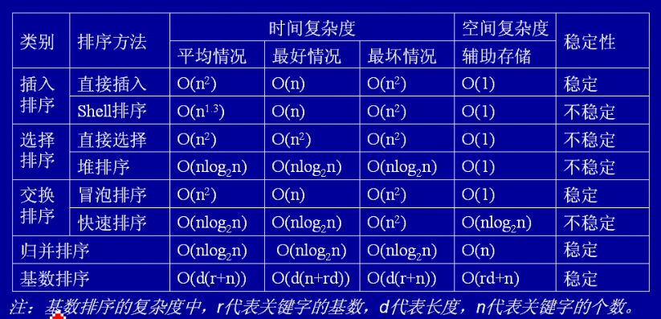

<font size=6>Python实现常用算法----基础版本 </font>

###<font size=4>一、冒泡</font>
- 时间复杂度：O(N<sub>2</sub>)
- 空间复杂度：O(1)
- 稳定
``` Python
def bubbleSort(A,n):
    for i in range(n):
        for j in range(n-i-1):
            if A[j] > A[j+1]:
                A[j],A[j+1] = A[j+1],A[j]
    return A
```

###<font size=4>二、选择排序</font>
- 时间复杂度：O(N<sub>2</sub>)
- 空间复杂度：O(1)
- 不稳定
``` Python
def selectionSort(A,n):
    for i in range(n):
        min_ = i 
        for j in range(i+1,n):
            if A[min_] > A[j]:
                min_ = j
        A[i],A[min_] = A[min_],A[i]
    return A
```

###<font size=4>三、插入排序</font>
- 时间复杂度：O(N<sub>2</sub>)
- 空间复杂度：O(1)
- 稳定
```Python
def insertSort(A,n):
    for i in range(1,n):
        key = A[i]
        for j in range(i,-1,-1):
            if A[j] > key:
                A[j+1],A[j] = A[j],key
    return A
```

###<font size=4>四、归并排序</font>
- 时间复杂度：O(N<sub>2</sub>)
- 空间复杂度：O(n)
- 不稳定
``` Python
def mergeSort(A,n):
    if n <= 1:
        return A
    mid = n/2
    left = mergeSort(A[:mid])
    right = mergeSort(A[mid:])
    return merge(left,right)
def merge(left,right):
    i,j = 0,0
    res = []
    while i < len(left) and j < len(right):
        if left[i] < right[j]:
            res.append(left[i])
            i += 1
        else:
            res.append(right[j])
            j += 1
    res += left[i:]
    res += right[j:]
    return result
```

###<font size=4>五、快速排序</font>
- 时间复杂度：O(N*log<sup>N</sup>)
- 空间复杂度：O(N*log<sup>N</sup>)
- 不稳定
```Python
def quickSort(A,n):
    return quick(A,0,n-1)
def quick(lists,left,right):
    if left >= right:
        return lists
    key = lists[left]
    low,high = left,right
    while left < right:
        while left < right and lists[right] >= key:
            right -= 1
        lists[left] = lists[right]
        while left < right and lists[left] <= key:
            left += 1
        lists[right] = lists[left]
    lists[right] = key
    quick(lists,low,left-1)
    quick(lists,left+1,high)
    return lists

```

###<font size=4>六、堆排序</font>
- 时间复杂度：O(N*log<sup>N</sup>)
- 空间复杂度：O(1)
- 不稳定
```Python
def heapSort(A,n):
    for i in range(n/2+1,-1,-1):
        MaxHeapFixDown(A,i,n)
    for i in range(n-1,-1,-1):
        A[0],A[i] = A[i],A[0]
        MaxHeapFixDown(A,0,i)
    return A
def MaxHeapFixDown(A,i,n):
    tmp = A[i]
    j = 2*i+1
    while j < n:
        if j + 1 < n and A[j+1] > A[j]:
            j += 1
        if A[j] < tmp:
            break
        A[i] = A[j]
        i = j 
        j = 2*i+1
    A[i] = tmp
```

###<font size=4>七、希尔排序</font>
- 时间复杂度：O(N<sub>2</sub>)
- 空间复杂度：O(1)
- 不稳定
```Python
def shellSort(A,n):
    import random
    gap = random.randint(0,n/2)
    while gap > 0:
        for i in range(gap,n):
            tmp = A[i]
            j = i
            while j >= gap and A[j-gap] > tmp:
                A[j] = A[j-gap]
                j -= gap
            A[j] = tmp
        gap = int(round(gap/2))
    return A
```

###<font size=4>八、基数排序</font>
- 时间复杂度：O(d(r+N)) *r为关键字基数，d为长度，n为关键字个数*
- 空间复杂度：O(rd+n)
- 稳定
```Python
import math
def radix_sort(lists, radix=10):
    k = int(math.ceil(math.log(max(lists), radix)))
    bucket = [[] for i in range(radix)]
    for i in range(1, k+1):
        for j in lists:
            bucket[j/(radix**(i-1)) % (radix**i)].append(j)
        del lists[:]
        for z in bucket:
            lists += z
            del z[:]
    return lists
```

###<font size=4>常用算法总结</font>

